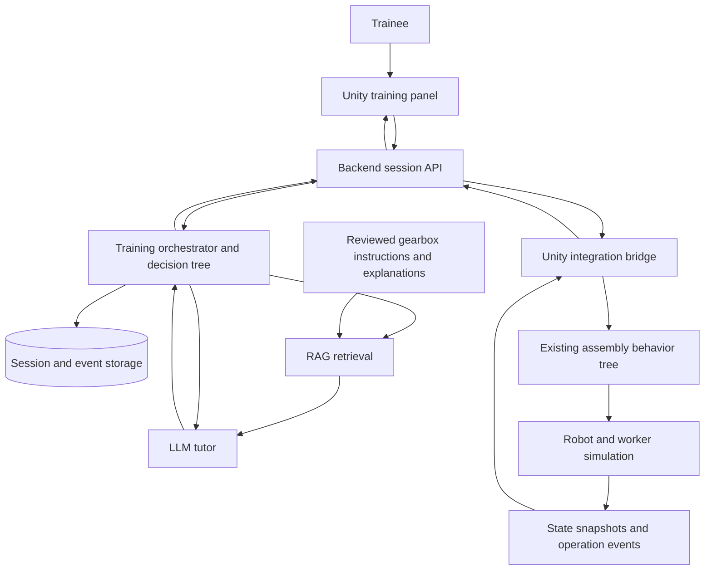
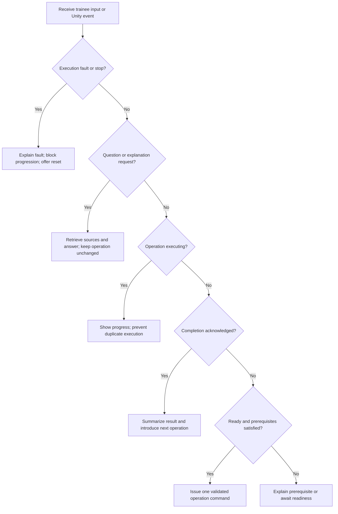

# Gearbox training proof-of-concept architecture

## Goal and confirmed prototype scope

Teach a new employee the gearbox assembly process through explanations, questions, and a simulated human–robot workcell. Unity already implements the assembly demonstration. This architecture adds an interactive training layer.

Confirmed user choices: a compact floating voice panel appears inside Unity; the trainee speaks questions and readiness confirmations and watches Unity execute each operation, including the simulated worker's human actions. Optional subtitles accompany spoken explanations. “Go back” restores actual assembly checkpoints rather than only reviewing text. Direct part manipulation is outside the first prototype. There is no physical robot integration in this scope. See TRAINING_SETUP.md for the implementation and startup instructions; the sections below retain the original design context where relevant.

## System structure

Use one backend service for the proof of concept, with modules for sessions, workflow policy, retrieval, and LLM calls. A local database and a small document index are sufficient initially; separate microservices are unnecessary.

## Responsibilities

| Component | Responsibility |
|---|---|
| Unity simulation | Own the actual simulated part, robot, worker, and assembly state. Execute validated operations and report outcomes. |
| Unity integration bridge | Send state/events, receive commands, validate command freshness, and invoke the simulation on Unity's main thread. |
| Training orchestrator | Own the training session, explanation history, readiness confirmations, command lifecycle, and allowed next training actions. |
| Decision tree | Select the next teaching response from explicit conditions: question, confusion, readiness, completion, or failure. |
| RAG | Retrieve reviewed instructions relevant to the current operation and question, with source identifiers. |
| LLM tutor | Explain retrieved knowledge in context and answer questions. It must not declare a simulated step complete or directly control motion. |
| Storage | Persist session history, document versions, state snapshots, commands, events, and learner feedback. |

The backend stores Unity's last acknowledged state; it does not assume that sending a command changes the world. Unity remains the authority for execution and completion. On reconnect, reconcile the session with a fresh Unity snapshot before issuing another command.

## Training loop

1. Unity starts in training mode with autoplay disabled, connects, and publishes a ready-state snapshot.
2. The backend identifies the next eligible operation from the versioned workflow and Unity state.
3. Retrieval selects that operation's instructions, purpose, prerequisites, and common mistakes.
4. The tutor explains what will happen, which actor performs it, and what the trainee should observe.
5. The trainee asks questions, requests another explanation, or confirms readiness.
6. The orchestrator validates readiness and sends an `execute_operation` command with the expected operation and state revision.
7. Unity validates prerequisites and executes exactly one operation through its existing behavior tree.
8. Unity reports completion or failure and publishes the resulting state. The backend advances only on an acknowledged completion.
9. The tutor summarizes the result and prepares the next operation. An optional short knowledge check can gate progression.

## Decision tree versus behavior tree

The decision tree controls teaching, while the behavior tree controls simulated execution. Use a deterministic rule-based decision tree initially; a learned classifier is a separate research extension.

Questions may be answered during execution using the latest snapshot, but a question alone should not cancel or reset motion. Explicit pause remains available.

## Workflow and state contracts

Give each of the existing 13 operations a stable identifier rather than identifying operations by displayed text or numeric index alone. A versioned workflow manifest should contain `operation_id`, actor, part IDs, prerequisites, expected effects, and knowledge references. Bind those IDs to Unity tree nodes and verify that the frontend and backend use the same workflow version.

Keep simulated execution states separate from teaching states:

- Execution: `ready`, `executing`, `paused`, `completed`, `faulted`, `emergency_stopped`.
- Teaching: `explaining`, `awaiting_readiness`, `answering_question`, `observing`, `reviewing`.

Each Unity snapshot should include session/run ID, workflow version, monotonic state revision, current operation/subaction, completed operation IDs, installed part IDs, payload/holder, execution state, and fault details. A reset creates a new run ID so delayed events from the previous run cannot advance the new run.

Each command should include command ID, session/run ID, expected state revision, operation ID, and command type. Unity rejects stale or out-of-order commands and returns the existing result for duplicate IDs. Start with one in-flight execution command. Backend timeouts mean execution status is unknown: request a fresh snapshot instead of automatically repeating the command.

Unity emits `operation_started`, `operation_completed`, `operation_failed`, `paused`, `reset_completed`, and `state_snapshot` events. Events need unique IDs and ordering information so the backend can deduplicate retries.

## API surface

An illustrative contract, independent of backend framework:

| Endpoint | Purpose |
|---|---|
| `POST /sessions` | Create a training session tied to a workflow version. |
| `POST /sessions/{id}/messages` | Ask a question or request an explanation. |
| `POST /sessions/{id}/actions` | Explicit readiness, pause, review, and reset requests. |
| `POST /sessions/{id}/events` | Receive Unity execution events and state snapshots. |
| `GET /sessions/{id}/commands` | Let Unity poll pending commands. |
| `POST /sessions/{id}/commands/{commandId}/ack` | Acknowledge acceptance, rejection, or completion. |
| `GET /sessions/{id}` | Retrieve the current reconciled session and tutor response. |

HTTP polling is an adequate starting transport for this local proof of concept. It avoids an initial requirement for persistent sockets. Keep pause and emergency stop locally available in Unity even if the backend is unavailable. Backend/model credentials belong in the service, never in the Unity client.

## RAG knowledge preparation

Create a reviewed gearbox knowledge pack rather than beginning with retiree interviews. For each operation include purpose, actor responsibilities, part identification, prerequisites, instructions, visual completion cues, common mistakes, and supporting sources. Store document ID, section, operation ID, and version alongside each indexed passage.

Retrieve by operation ID first, then search within relevant knowledge for the question. Give the LLM the retrieved passages plus the current Unity state and conversation context. Responses should include source references and distinguish documented assembly facts from observations of the simulation. If evidence is missing, the tutor should say so rather than invent tolerances, tightening torques, or engineering instructions. Existing simulation code describes demonstrated behavior but does not establish mechanically validated assembly guidance.

## Reviewing earlier steps

Implement two separate actions:

- **Review explanation:** revisit earlier text, diagrams, or a knowledge check without changing simulated state.
- **Replay demonstration:** initially reset and execute the prerequisite sequence up to the selected operation. Preserve the learning history, but begin a new simulation run.

The current implementation supports reset and forward stepping, not arbitrary undo. Add intermediate checkpoints only if replay time becomes a problem; checkpoints must restore parts, transforms, occupancy, ownership, tree status, and motion state together.

## Changes needed in the current Unity project

`Assets/Scripts/Core/GearboxGameSimulation.cs` is the active runtime. It already exposes execution controls and assembly state. Keep its motion logic and `AssemblyBehaviourTree.cs` as the execution foundation.

Add an explicit training/demo mode, operation IDs, completion/failure events, serialized snapshots, an integration bridge, and the training panel. Training mode should wait for trainee readiness instead of calling `Play()` automatically. Validate remote requests at operation boundaries. The runtime currently disables other MonoBehaviours on the manager object during startup: place the bridge on a separate object or adjust that disabling logic deliberately.

The existing `Step()` means forward execution to the next operation boundary; define whether a mid-operation request is rejected or resumes the active operation. Do not expose an ambiguous remote "next" action while motion is running.

## Implementation milestones and acceptance

1. **State-aware integration without an LLM:** Unity starts idle; a backend command executes one operation; the backend advances only after the matching event. Verify duplicates, stale commands, disconnects, pause, and reset during execution.
2. **Scripted teaching:** add the panel and reviewed operation explanations. Complete the full 13-operation session with readiness gates and earlier-step review.
3. **RAG tutor:** add retrieval and LLM explanations with references. Verify answers against a small reviewed question set and verify missing-information responses.
4. **Teaching decision tree:** add explicit clarification and readiness branches, optional knowledge checks, and learner history.
5. **Thesis evaluation:** measure grounded-answer quality, workflow correctness, training completion time, clarification requests, and learner understanding. Compare guided training with the existing autoplay demonstration where feasible; do not claim improved learning without collecting evidence.

The backend, Unity voice interface, Windows speech adapter, and runtime checkpoint restoration are now implemented in the root project. See TRAINING_SETUP.md for the current behavior and setup; model quality and full spoken interaction require target-PC testing.
